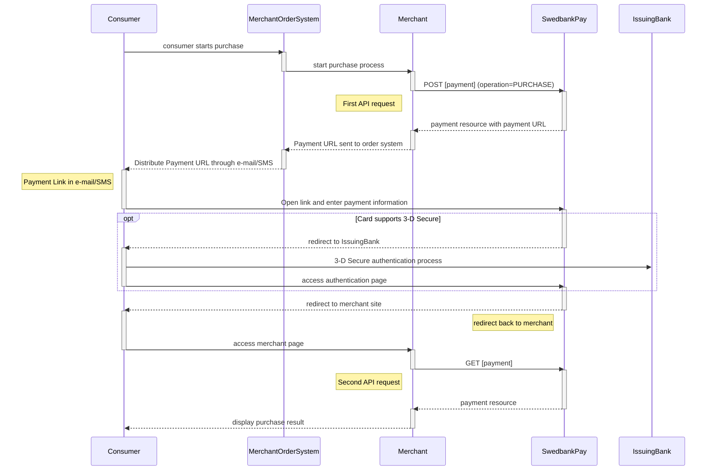







## Prerequisites

To start integrating Swedbank Pay Mobile Pay, you need the following:

* [HTTPS][https] enabled web server.
* Agreement that includes Swedbank Pay Mobile Pay.
* Obtained credentials (merchant Access Token) from Swedbank Pay through
  Swedbank Pay Admin.

## Introduction

* When you have prepared your merchant/webshop site, you make a `POST` request
  towards Swedbank Pay with your Purchase information.
  You will receive a Redirect URL, leading to a secure Swedbank Pay hosted
  environment, in response.
* You need to redirect the browser of the end-user/consumer to that URL so
  that she may enter her MobilePay details .
* When the payment is completed, Swedbank Pay will redirect the browser back
  to your merchant/webshop site.
* Finally you need to make a `GET` request towards Swedbank Pay with the
  `paymentID` received in the first step, which will return the purchase result.

## API requests

The API requests depend on the payment instrument you are using when implementing
the Payment Link scenario, see [purchase flow](#purchase-flow).
One-phase payment metods will not implement capture, cancellation or reversal.
The options you can choose from when creating a payment with key operation set
to Value Purchase are listed below.

### Type of authorization (Intent)

**Authorization (two-phase)**: The intent of a MobilePay purchase is always
`Authorization`. The amount will be reserved but not charged.
You will later (i.e. if a physical product, when you are ready to ship the
purchased products) have to make a [Capture][mobilepay-capture] or
[Cancel][mobilepay-cancel] request.

## Screenshots

When clicking the payment link, the consumer will be directed to a payment
page, similar to the examples below, where payment information can be entered.

![Payex payment menu][paymentMethodsScreenshot]

## Purchase flow

The sequence diagrams display the high level process of the purchase,
from generating a Payment Link to receving a Callback.
This in a generalized flow as well as a specific 3-D Secure enabled credit
card scenario.



When dealing with credit card payments, 3-D Secure authentication of the
cardholder is an essential topic.
There are two alternative outcome of a credit card payment:

* 3-D Secure enabled - by default, 3-D Secure should be enabled, and Swedbank
  Pay will check if the card is enrolled with 3-D Secure.
  This depends on the issuer of the card.
  If the card is not enrolled with 3-D Secure, no authentication
  of the cardholder is done.
* Card supports 3-D Secure - if the card is enrolled with 3-D Secure,
  Swedbank Pay will redirect the cardholder to the autentication mechanism
  that is decided by the issuing bank.
  Normally this will be done using BankID or Mobile BankID.



[paymentMethodsScreenshot]: /assets/img/checkout/payment_methods.PNG
[https]: /#connection-and-protocol
